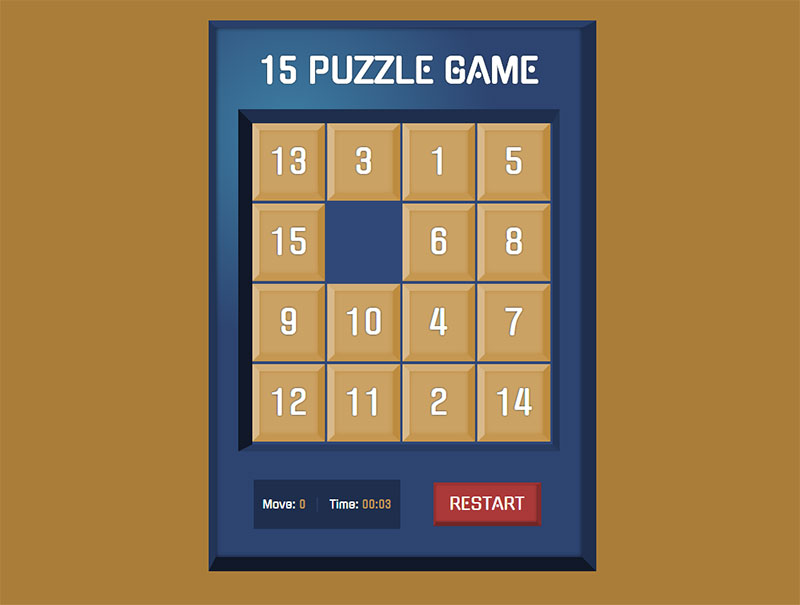

# 15-Puzzle Game

> The 15-puzzle (also called Gem Puzzle, Boss Puzzle, Game of Fifteen, Mystic Square and many others) is a sliding puzzle that consists of a frame of numbered square tiles in random order with one tile missing. - From **[Wikipedia](https://en.wikipedia.org/wiki/15_puzzle)**

The 15-puzzle game is implemented with JavaScript. [Please enjoy the game!](http://15puzzlegame.netlify.app/)

## Game Rules

1. Press the start button to start the game.
2. Arrange the puzzle tiles in order from 1 to 15.
3. Upon completion, the empty space should be on the bottom right.
4. If you click a numbered tile in the same row or column as the blank space, you can slide the tiles to the empty space.
5. Press the restart button to reset the number of moves, the timer, and the puzzle.

## Contributions

- [bohyeon-n](https://github.com/bohyeon-n)
- [chiabi](https://github.com/chiabi)

This game was created by forking the basic development environment of the [fds-hackathon-template](https://github.com/fds9/fds-hackathon-template) that [seungha-kim](https://github.com/seungha-kim) created.
